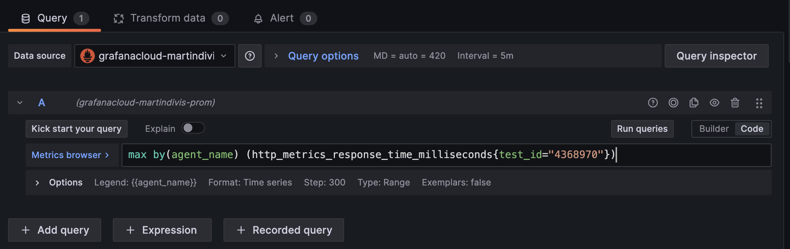
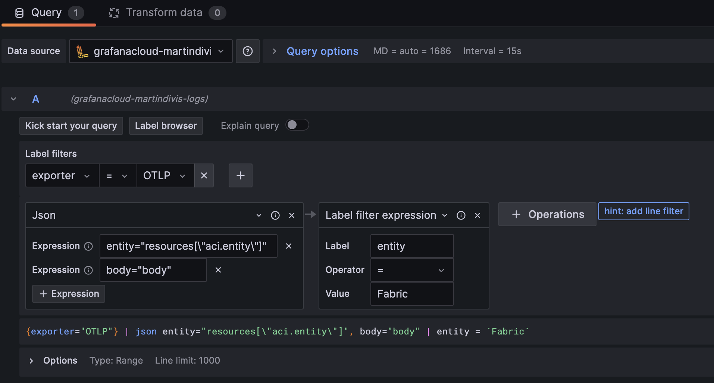
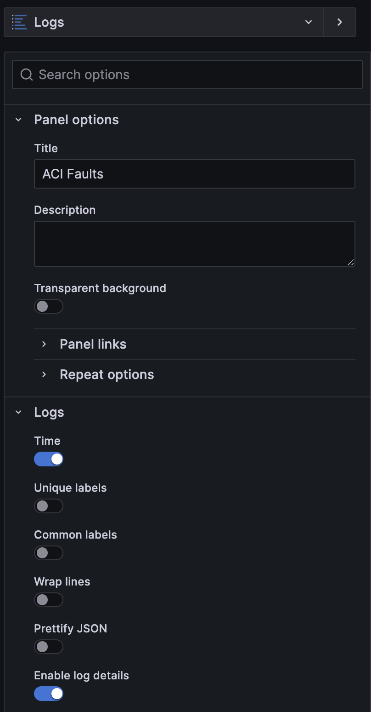

# Lab Content for DEVNET-1606 - What happened in my Data Center last night?

In this lab, you'll achieve 3 major steps:
1) Run your first OpenTelemetry collector
2) Get ThousandEyes data via OpenTelemetry
3) Build custom OpenTelemetry collector with Cisco Intersight support

Requirements for the full lab:
1) Make, Git, and Go language installed on your machine. https://go.dev/
2) Account on Grafana Cloud - needed for all labs, since all data acquired via OpenTelemetry will be sent to Grafana Cloud.
3) Account at ThousandEyes - needed for 2nd lab
4) Account at Cisco Intersight - needed for 3rd lab
5) Cisco ACI fabric or simulator available - needed for 3rd lab
6) (Optional) Splunk installed

All the labs can be exercised without any costs incurred.

### Prepare your Grafana Cloud credentials fro OpenTelemetry

1) Create an account on Grafana Cloud (if you do not have one) at https://grafana.com/
2) Once you are in Grafana Cloud Portal, click Access Policies in the left-hand menu
3) Click **Create Access Policy**
4) Window pops up. Create a policy with name, for example, otel, display name OpenTelemetry, and realm  as your username, and scopes **metrics:write** and **logs: write**. Submit.
5) Add token to the created access policy by clicking **Add Token** button on the bottom right of the created policy box. Copy the token and store it safely!
6) Go back to Grafana Cloud Portal by clicking your username under GRAFANA CLOUD in the left hand menu
7) Click **Details** button for Prometheus service and note "Remote Write Endpoint URL" and "Username / Instance ID"
8) Click **Details** button for Loki service note "URL" and "User" items for later use

That's it for now with Grafana!

## Lab 1 - Getting first OpenTelemetry collector up and running

In this lab, you'll setup your first OpenTelemetry collector, collect performance data from your machine, send it to Grafana Cloud, and display the data on dashboard.

We're going to start with OpenTelemetry Collector Contrib project. 
- Go to https://github.com/open-telemetry/opentelemetry-collector-contrib
- Clone the repo to your machine: `git clone https://github.com/open-telemetry/opentelemetry-collector-contrib.git`
- Change directory to `cd opentelemetry-collector-contrib`
- Run `make otelcontribcol` - this will build the collector executable. It's going to take a while for the first time. The executable will be placed in the `bin` directory
- Try running the collector `bin/otelcontribcol_darwin_amd64 --version` - name of the executable may be different based on your operating system and processor architecture. There should be response like "otelcontribcol version 0.91.0-dev".
- To make our life simpler, copy the executable to a generic name `cp bin/otelcontribcol_darwin_amd64 bin/otelcol`
- Change directory back to the parent directory `cd ..`

Now you have to prepare configuration file for the collector. Create file `config-lab1.yaml` and copy following content to it:
~~~
receivers:
  hostmetrics:
    collection_interval: 60s
    scrapers:
      load:
      memory:
    
processors:

# for Grafana Cloud - see https://grafana.com/docs/opentelemetry/collector/send-otlp-to-grafana-cloud-databases/
extensions:
  basicauth/metrics:
    client_auth:
      username: "<GRAFANA PROMETHEUS-USERNAME/INSTANCE ID>"
      password: "<GRAFANA API TOKEN>"
  basicauth/logs:
    client_auth:
      username: "<GRAFANA LOKI-USERNAME>"
      password: "<GRAFANA API TOKEN>"

exporters:
  prometheusremotewrite/grafana:
    endpoint: <GRAFANA PROMETHEUS ENDPOINT URL>
    auth:
      authenticator: basicauth/metrics
    resource_to_telemetry_conversion:
      enabled: true      
  loki/grafana:
    endpoint: <GRAFANA LOKI ENDPOINT URL>
    auth:
      authenticator: basicauth/logs

  logging:
    verbosity: detailed

service:
  extensions: [basicauth/metrics]
  pipelines:
    metrics:
      receivers: [hostmetrics]
      processors: []
      exporters: [logging]
      # exporters: [logging, prometheusremotewrite/grafana]
~~~

Replace placeholders in the configuration file with previously noted credentials for Grafana Cloud.

Run `./opentelemetry-collector-contrib/bin/otelcol --config=config-lab1.yaml`

Since at this point, we have only **logging** exporter configured in pipeline, we test the collection of the cpu and memory load data and collector's basic functionality. You should see output similar to this:

~~~
NumberDataPoints #0
StartTimestamp: 2023-12-30 20:16:36 +0000 UTC
Timestamp: 2024-01-02 09:00:43.463493 +0000 UTC
Value: 3.501953
ResourceMetrics #1
Resource SchemaURL: https://opentelemetry.io/schemas/1.9.0
ScopeMetrics #0
ScopeMetrics SchemaURL: 
InstrumentationScope otelcol/hostmetricsreceiver/memory 0.91.0-dev
Metric #0
Descriptor:
     -> Name: system.memory.usage
     -> Description: Bytes of memory in use.
     -> Unit: By
     -> DataType: Sum
     -> IsMonotonic: false
     -> AggregationTemporality: Cumulative
NumberDataPoints #0
Data point attributes:
     -> state: Str(used)
StartTimestamp: 2023-12-30 20:16:36 +0000 UTC
Timestamp: 2024-01-02 09:00:43.463562 +0000 UTC
Value: 10580475904
NumberDataPoints #1
Data point attributes:
     -> state: Str(free)
StartTimestamp: 2023-12-30 20:16:36 +0000 UTC
Timestamp: 2024-01-02 09:00:43.463562 +0000 UTC
Value: 324333568
NumberDataPoints #2
Data point attributes:
     -> state: Str(inactive)
StartTimestamp: 2023-12-30 20:16:36 +0000 UTC
Timestamp: 2024-01-02 09:00:43.463562 +0000 UTC
Value: 6275059712
        {"kind": "exporter", "data_type": "metrics", "name": "logging"}
~~~

Now, un-comment the last line `config-lab1.yaml` and comment out the line `# exporters: [logging]` to enable output to Grafana Cloud.

Start the collector again: `./opentelemetry-collector-contrib/bin/otelcol --config=config-lab1.yaml`

Let's view the data in Grafana now. Click **Launch** button on the **Grafana** gray box. It will launch your Grafana GUI.

Click **Dashboards** in the menu in the left hand side.

Click the blue **New** button to create a new dashboard. You should see this:

Click **Add visualisation**.

Select datasource - `grafanacloud-<your-instance-name>-prom`

In the **Metric** field on the form, select `system_memory_usage_bytes` like this:

Click **Run queries** button and a widget should load data like this:

Congratulations, if you made it here! Let's save this widget by clicking **Apply** button on the top right and create another for CPU load by clicking **Add** -> **Visualisation**.

Now, select metric `system_cpu_load_average_1m_ratio` and repeat the process. In the and, you should have a dashboard like this:

This concludes tle Lab1 exercises. You may play with Grafana more - rename widgets and dashboards, play with time ranges etc.

## Lab2 - Getting ThousandEyes data over OpenTelemetry

Requirements (on top of Lab1):
1) ThousandEyes account
2) A server accessible from the Internet
 with DNS name
3) Certificate for HTTPS for the DNS name of the server

### Getting ThousandEyes test account

If you do not have a ThousandEyes account, you can create a trial account for an e-mail address you have access to. In this case, do the following:

1) Go to https://www.thousandeyes.com/
2) Click **Start Free Trial** button
3) Fill in the form, activate account by clicking on a link sent by e-mail, set ThousandEyes password and you should see this:

Now, let's setup a ThousandEyes to test a website of our choice for Digital Experience metrics.

Click **Cloud & Enterprise Agents** -> **Test Settings**

Select **Page Load** test from the second row of buttons

Fill in the form like this: (you can choose another website to monitor)

Select agents like this:

Click **Create New Test** button

Verify, that the test collects the data. Click on **Cloud & Enterprise Agents** -> **Views**

Select the test you just created if it's not selected already. After a while, you will see the first batch of metrics coming and see something like this:

Once we have this running, we can leave test to collect more data and focus on OpenTelemetry infrastructure.

What we need to achieve is this:

ThousandEyes -> (OTLP data) -> OpenTelemetry Collector -> (Prometheus data) -> Grafana Cloud

For this, we need OpenTelemetry Collector accessible from the internet. Best choice is a public cloud instance with resources sufficient for running OpenTelemetry collector. The data from ThousandEyes to OpenTelemetry collector use OTLP protocol over HTTPS. ThousandEyes requires a valid certificate on the OpenTelemetry collector side, otherwise, ThousandEyes cannot connect to such collector. 

Personally, I'm using an instance on Oracle Cloud, my private domain, and LetsEncrypt certificates for this - costs are associated only with my registered domain. There's a wide choice of services available, for example AWS with AWS Certificate Manager and Amazon Route 53, GCP Domain and Certificate Managers, etc. Or, your company may have such infrastructure ready and you'll be able to use it. This is beyond the instructions for this lab.

Once you have a VM available on the Internet with DNS name and certificates, you can start putting all the things together.

Let's setup an OpenTelemetry collector on the VM first. As we have already seen in the Lab1, we need to build our collector first. If you have built your collector on the same CPU architecture and OS as is used by your VM, you can use the same executable. Other options are building the collector on the VM directly following the same instructions again, or, build it on your development machine by choosing different CPU architecture and OS, like this:

1) Change to directory `cd opentelemetry-collector-contrib/cmd/otelcontribcol`

2) Set variables for CPU architecture and target OS, for example: `export GOOS=linux GOARCH=amd64` 
   
3) Run `GO111MODULE=on CGO_ENABLED=0 go build -trimpath -o ../../bin/otelcontribcol_${GOOS}_${GOARCH} .` where GOOS and GOARCH specify your OS and CPU architecture

4) Copy the built executable from the `../../bin` directory to the VM

5) Go back to your lab root directory `cd ../../..`

Now, prepare the configuration file for the collector. Copy the `config-lab1.yaml` to `config-lab2.yaml`.

Change the receivers section so, that it looks like this:

~~~
receivers:
  otlp:
    protocols:
      grpc:
        endpoint: 0.0.0.0:4317
        tls:
          cert_file: f-server.crt # should contain full certificate chain
          key_file: server.key
      http:
        endpoint: 0.0.0.0:4318
        tls:
          cert_file: f-server.crt # should contain full certificate chain
          key_file: server.key
~~~

and service section will look like this:

~~~
service:
  extensions: [basicauth/metrics]
  pipelines:
    metrics:
      receivers: [otlp]
      processors: []
      exporters: [logging, prometheusremotewrite/grafana]
~~~

The certificate and key files have to be located in the same directory, from which you're going to run the collector. For this exercise, we recommend to place collector executable, collector configuration file, and certificates and keys in the same directory.

Since the collector listens on ports 4317 and 4318, don't forget to open them up on your OS firewall for inbound TCP connections.

Now, run the collector on the VM: `./otelcol --config=config-lab2.yaml`

Now it's time to ask ThousandEyes to send us the metrics from the test created earlier. ThousandEyes does not provide a GUI functions to set this up, it's done by configuring ThousandEyes via REST API calls. 

To use ThousandEyes API calls, you need to set authentication mechanism first. In ThousandEyes page, go to **Account Settings** -> **Users & Roles** and in **Profile** tab, generate an **OAuth Bearer Token** on the bottom of the page. Note the token string, it's displayed only once!

REST API can be used in multiple ways - for example using popular Postman, using a REST Client plugin for VS Code, or directly from command line using curl. In this lab, we'll use curl.

Prepare OAuth tone for use:

~~~
export TOKEN=<your OAuth Bearer Token>>
~~~

Create a tag, which will be assigned to tests and bound to OpenTelemetry Collector stream. The values of `key` and `value` are user defined. 

~~~
curl -X POST \
     -d '{ "key": "oteltag", "value": "OpenTelemetry", "objectType": "test", "accessType": "all" }'' \
     -H "Content-Type: application/json" \
     -H "Authorization: Bearer ${TOKEN}" \
     https://api.thousandeyes.com/v7/tags
~~~

you should get response like `{"id":"e467d9da-6eda-4162-bbcb-2d6471cb9a29","aid":2017107,"objectType":"test","key":"oteltag","value":"OpenTelemetry","color":"#A7EB10","accessType":"all","createDate":"2024-01-02T14:15:23Z","legacyId":null}` , which defines the created tag. 

IMPORTANT - make a note of `id` field - it's the tag's id you will need later. Run `export TAGID=<<tagId>>`.

You can also get list of tags by running

~~~
curl -X GET \
     -H "Content-Type: application/json" \
     -H "Authorization: Bearer ${TOKEN}" \
     https://api.thousandeyes.com/v7/tags
~~~

Now assign the tag to a test. To do that, we need to get the ID of the test first:

~~~
curl -X GET \
     -H "Content-Type: application/json" \
     -H "Authorization: Bearer ${TOKEN}" \
     https://api.thousandeyes.com/v7/tests
~~~

Find the `testId`(s) for the test(s) you want to report. In my case, it's `4558484`, you will have a different value. Make a note of it.

Now assign the tag to the test(s) by running:

~~~
curl -X POST \
     -d '{ "assignments": [ { "id": "4558484", "type": "test" } ]}' \
     -H "Content-Type: application/json" \
     -H "Authorization: Bearer ${TOKEN}" \
     https://api.thousandeyes.com/v7/tags/${TAGID}/assign
~~~

ThousandEyes will reply with the list of assignments: `{"tagId":"e467d9da-6eda-4162-bbcb-2d6471cb9a29","assignments":[{"id":"4558484","type":"test"}]}`

Last step is to create OpenTelemetry stream by assigning the tag to the stream and defining the stream target endpoint - your VM with the collector. The values for `key` and `value` must match the earlier defined tag. The value of `streamEndpointUrl` must be set to the URL of your collector, something like `https://my-otelcol-vm.my-domain.com:4317`.

~~~
curl -X POST \
     -d '{ "type": "opentelemetry", "tagMatch": [{"key": "oteltag", "value": "OpenTelemetry", "objectType": "test" }], "endpointType": "grpc", "streamEndpointUrl": "<<OTLP endpoint URL>>" }' \
     -H "Content-Type: application/json" \
     -H "Authorization: Bearer ${TOKEN}" \
     https://api.thousandeyes.com/v7/stream
~~~

Response should look like this: `{"id":"cfa959e4-86ef-4930-a687-256f37ad95e3","enabled":true,"type":"opentelemetry","endpointType":"grpc","streamEndpointUrl":"https://my-otelcol-vm.my-domain.com:4317","tagMatch":[{"key":"oteltag","value":"OpenTelemetry","objectType":"test"}],"auditOperation":{"createdDate":1704205943976,"createdBy":3385222},"_links":{"self":{"href":"https://api.thousandeyes.com/v7/stream/cfa959e4-86ef-4930-a687-256f37ad95e3"}}}`

It's also possible to see the actual stream definition by running:

~~~
curl -X GET \
     -H "Content-Type: application/json" \
     -H "Authorization: Bearer ${TOKEN}" \
     https://api.thousandeyes.com/v7/stream
~~~

and to delete the stream by running:

~~~
curl -X DELETE \
     -H "Content-Type: application/json" \
     -H "Authorization: Bearer ${TOKEN}" \
     https://api.thousandeyes.com/v7/stream/<<streamID>>
~~~

Now, when you go to your running collector, you should see incoming telemetry data after each ThousandEyes test interval (so if you have tests setup at 10 minutes interval, you will see output from the collector also in 10 minute intervals). And since you also have the Grafana exporters already configured, it's time to go to Grafana to setup visualizations!

As you did in the first part of this lab, create a new Grafana dashboard and start adding a visualization to it. Add a default Time Series widget.

In the Query for of the widget, select the grafanacloud Prometheus datasource (it should be a default option) and paste a Prometheus query string like this: `max by(agent_name) (http_metrics_response_time_milliseconds{test_id="4368970"})` where the test_id value equals to id of one of your tests you have tagged for OpeTelemetry stream previously in ThousandEyes. 

Click **Run queries** button and the widget should fill with time series for HTTP response time for each ThousandEyes agent you have selected for that test!

Congratulation, if you made it here! 

Save the dashboard and play with other visualizations - use **Metric Browser** button to see what metrics are available.

## Lab 3 - Building a Custom OpenTelemetry Collector

In this lab, our goal is two-fold. One goal is to get metrics and logs/events/alerts from Cisco Intersight and from Cisco ACI. However, there are no OpenTelemetry collector receivers for those solutions published as of now. Therefore, you will see, how to build a collector with custom components, in our case, with custom receivers. 

While it is not really that complicated, it's a lot of coding and clearly beyond scope of a time limited lab. Therefore, we will walk you through of our experimental receivers. Then, you'll build it yourselves. 

First, clone the lab repository:

`git clone https://github.com/chrlic/clemea24-devnet-1606.git`

`cd clemea24-devnet-1606`

Install OCB tool by running 

`GO111MODULE=on go install go.opentelemetry.io/collector/cmd/builder@latest`

### Explore builder-config.yaml

The configuration file `builder-config.yaml` defines the configuration of the collector - what components, i.e. receivers, processors, exporters, extensions, and connectors, are included and what other libraries are needed for the build. It also specifies where to put the resulting collector binary.

Let's have a closer look.

~~~
dist:
  name: custom-otelcol    # Name of the resulting collector binary
  description: Custom OpenTelemetry Collector for Cisco Intersight and Cisco ACI 
  output_path: ./build
  otelcol_version: 0.91.0 # Should match the version of OCB tool
  version: 0.91.0         # Arbitrary version of the build collector
~~~

This section defines the versions and target for the resulting binary.

~~~
exporters:
  - gomod:
      go.opentelemetry.io/collector/exporter/loggingexporter v0.91.0
  - gomod:
      github.com/chrlic/otelcol-cust/collector/exporter/appdynamics v0.1.1
    path: collector/exporter/appdynamics
  - gomod:
      go.opentelemetry.io/collector/exporter/otlpexporter v0.91.0
  - gomod:
      github.com/open-telemetry/opentelemetry-collector-contrib/exporter/prometheusremotewriteexporter v0.91.0
  - gomod:
      github.com/open-telemetry/opentelemetry-collector-contrib/exporter/lokiexporter v0.91.0
~~~

This section defines exporters we will need. Those on path `go.opentelemetry.io/collector/exporter` come from the **core** collector. Those from `github.com/open-telemetry/opentelemetry-collector-contrib/exporter` come from the **contrib** collector. 

Since you're going to build your own components from source code too, the section:

~~~ 
  - gomod:
      github.com/chrlic/otelcol-cust/collector/exporter/appdynamics v0.1.1
    path: collector/exporter/appdynamics
~~~

points to a local directory containing a Go source code of the component. 

It's similar for other components, like receivers and processors.

The section:

~~~
replaces:
  - github.com/chrlic/otelcol-cust/collector/shared/contextdb => ../collector/shared/contextdb
  - github.com/chrlic/otelcol-cust/collector/shared/expressions => ../collector/shared/expressions
  - github.com/chrlic/otelcol-cust/collector/shared/jsonscraper => ../collector/shared/jsonscraper
~~~

enables to use shared modules used by multiple components and locate the source of the modules in a local filesystem

Finally, the section:

~~~
excludes:
  - github.com/knadh/koanf v1.5.0
~~~

enables to prevent download of certain libraries referenced by other libraries. In this case, this is a workaround of a known issue in the OpenTelemetry collector community. 

More on the configuration file is available at https://pkg.go.dev/go.opentelemetry.io/collector/cmd/builder#section-readme

### Using the OCB tool

First thing to do, is to check version of the tool using a command: `builder --version`. 

The lab was built with version 0.91.0, if your version is higher, it's a good idea to update all components referred to in `builder-config.yaml` which have the version 0.91.0 to the same version as the builder tool. While there tends to be a good backward compatibility, breaking changes sometimes occur. 

The custom collector then can be built by running `builder --config=builder-config.yaml` where the code generated by the builder and resulting executable will be placed into `build` subdirectory as configured in the configuration file. 

Next try running the built executable: `build/custom-otelcol --version`

### Using the collector for getting data from Cisco Intersight

If you inspected the section `receivers:` in the `builder-config.yaml`, you could see the reference to receivers for Cisco Intersight and Cisco ACI. Both are experimental, highly configurable receivers, which allow to collect data from Cisco Intersight and Cisco ACI via their REST API and convert the data to the OpenTelemetry format based on the specific scenario in mind. At the moment, metrics and logs OTel signals are supported. 

As you have seen previously, configuration file must be passed to the collector on startup. The repository you've cloned for this lab contains a sample set of configuration files for the collector and individual receivers.

Let's look at the collector configuration file changes.

For the receivers, you need to add configuration for Cisco Intersight and Cisco ACI. You can also do only one of them if you do not have both available. Add this to the `receivers:` section:

~~~
  ciscoaci/metrics:
    interval: 60
    aci:
      host: "$ACI_HOST"
      port: 443
      protocol: https
      user: "$ACI_USERNAME"
      password: "$ACI_PASSWORD"
    queries:
    - conf/aci/aci-sys-hf.yaml
    - conf/aci/aci-node-pwr.yaml
  ciscoaci/logs:
    interval: 60
    aci:
      host: "$ACI_HOST"
      port: 443
      protocol: https
      user: "$ACI_USERNAME"
      password: "$ACI_PASSWORD"
    queries:
    - conf/aci/aci-sys-logs.yaml
  ciscointersight/metrics:
    intersight:
      apiKeyId: $INTERSIGHT_API_KEY_ID
      apiKeyFile: conf/intersightPrivateKey.txt
    queryFiles:
    - conf/is/is-metric-server-health.yaml
    - conf/is/is-metric-ts-db-power.yaml
    interval: 60
  ciscointersight/logs:
    intersight:
      apiKeyId: $INTERSIGHT_API_KEY_ID
      apiKeyFile: conf/intersightPrivateKey.txt
    queryFiles:
    - conf/is/is-log-alerts.yaml
    interval: 60
~~~

and replace all placeholders starting with $-sign with the actual value. The configuration for both receivers (and there are two instances for both, one for metrics and one for logs) is very similar. There are credentials, the collection interval (set to 1 minute), and reference to files in a local filesystem containing specific REST API requests - queries - to be sent to the monitored systems and rules how to convert them to OpenTelemetry data streams, which the collector can process in a normalized way. 

There are samples in the `conf` directory for requests collecting information about power and health statistics of certain objects, configuration changes, and details of alerts.

The receivers have to be enabled in the collector pipelines and pipeline for logs has to be setup, so the `service:` section will look like this:

~~~
service:
  extensions: [basicauth/metrics, basicauth/logs]
  pipelines:
    metrics:
      receivers: [ciscointersight/metrics, ciscoaci/metrics]
      exporters: [logging, prometheusremotewrite/grafana]
    logs:
      receivers: [ciscointersight/logs, ciscoaci/logs]
      exporters: [logging, loki/grafana]
  telemetry:
    logs:
      level: debug
~~~

Start the collector and check in the logs, that data is being collected and sent to Grafana Cloud.

In Grafana, visualize the metrics in similar way as you have done for OS metrics and ThousandEyes. Configuration files in the `conf` directory specify metric names and attributes which are then available for metric selection in Grafana. For logs, Use Logs widget in Grafana like this:

In Query, use **logs** datasource from the dropdown menu similar to this:

All logs are received in structured JSON format, so to select the right logs for your context, you need to parse the JSON and filter the desired data, like this:

Here, Json processing block is added by clicking **+ Operations** button. Then there are 2 variables created, entity and body. Entity is assigned a value of OpenTelemetry resource attribute `aci.entity` - see the collector configuration file for others - and body is assigned to the text of the log message. Then, filters can be set to use those variables, like here we filer out only those log messages having `aci.entity` resource attribute set by the collector to `Fabric`.

Experiment with different log visualizations in the **Logs** section of the widget configuration options on the right hand side!

This concludes Lab 3 - congratulation, if you made it so far! 

We certainly hope you enjoyed it and learned something useful, if not outright exciting. Let us know what you think in the **Discussions** or **Issues** of this Github project!